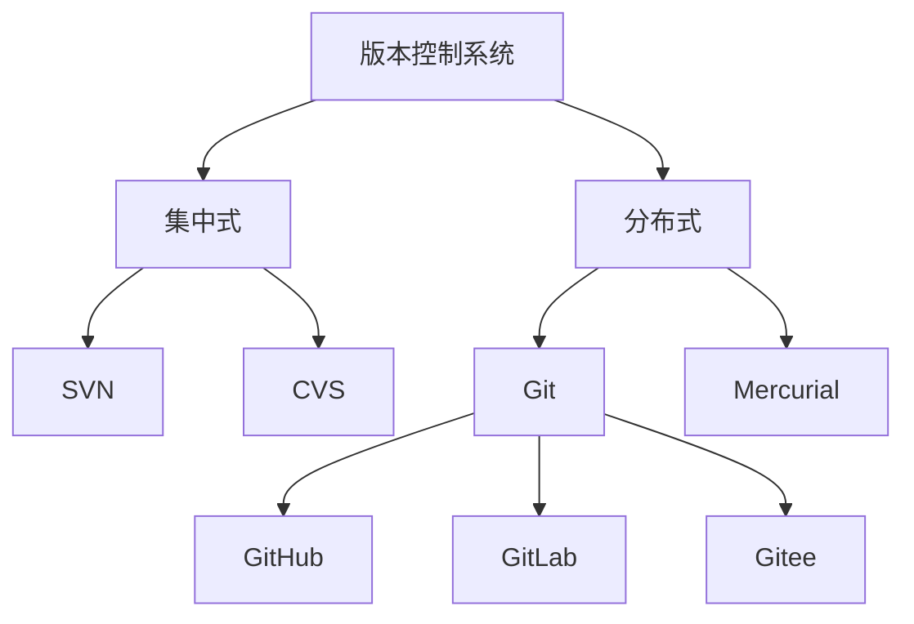
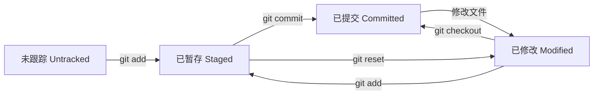
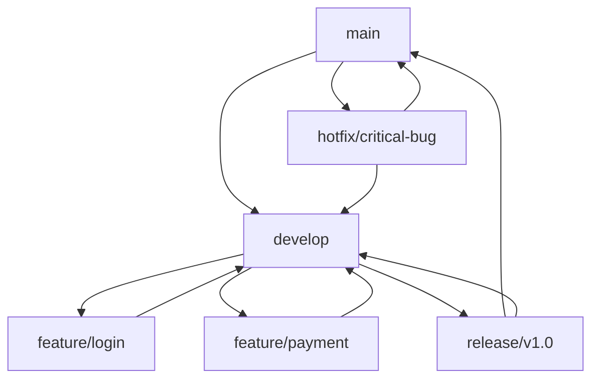

# Git 版本控制完整指南

Git 是目前世界上最先进的分布式版本控制系统，由 Linux 之父 Linus Torvalds 开发，是现代软件开发的必备工具。

## 📋 Git 简介

### 什么是版本控制？

版本控制是一种记录一个或若干文件内容变化，以便将来查阅特定版本修订情况的系统。

### Git 的优势

| 特性 | 说明 |
|------|------|
| **分布式** | 每个开发者都有完整的版本历史 |
| **高性能** | 快速的分支和合并操作 |
| **数据完整性** | 使用 SHA-1 哈希保证数据完整性 |
| **非线性开发** | 支持数千个并行分支 |
| **开源免费** | 完全开源，社区活跃 |

### Git vs 其他版本控制系统



## 🔽 安装 Git

### 1. Windows 安装

**方法一：官方安装包**

- 访问 [Git 官网](https://git-scm.com/download/win)
- 下载 Windows 版本
- 运行安装程序，推荐设置：
   - [x] Use Git from the Windows Command Prompt
   - [x] Checkout Windows-style, commit Unix-style line endings
   - [x] Use Windows default console window

**方法二：使用包管理器**

```powershell
# 使用 Chocolatey
choco install git

# 使用 Scoop
scoop install git
```

### 2. macOS 安装

**方法一：Homebrew**

```bash
# 安装 Homebrew（如果没有）
/bin/bash -c "$(curl -fsSL https://raw.githubusercontent.com/Homebrew/install/HEAD/install.sh)"

# 安装 Git
brew install git
```

**方法二：Xcode Command Line Tools**

```bash
# 安装 Xcode 命令行工具
xcode-select --install
```

### 3. Linux 安装

**Ubuntu/Debian**

```bash
# 更新包列表
sudo apt update

# 安装 Git
sudo apt install git

# 验证安装
git --version
```

**CentOS/RHEL/Fedora**

```bash
# CentOS/RHEL
sudo yum install git

# Fedora
sudo dnf install git

# 验证安装
git --version
```

**Arch Linux**

```bash
# 安装 Git
sudo pacman -S git

# 验证安装
git --version
```

## ⚙️ 初始配置

### 1. 用户信息配置

```bash
# 设置用户名
git config --global user.name "Your Name"

# 设置邮箱
git config --global user.email "your.email@example.com"

# 查看配置
git config --list
```

### 2. 编辑器配置

```bash
# 设置默认编辑器
git config --global core.editor vim

# 或者使用其他编辑器
git config --global core.editor "code --wait"  # VS Code
git config --global core.editor nano            # Nano
```

### 3. 其他有用配置

```bash
# 设置默认分支名
git config --global init.defaultBranch main

# 启用颜色输出
git config --global color.ui auto

# 设置换行符处理
git config --global core.autocrlf input  # Linux/macOS
git config --global core.autocrlf true   # Windows

# 设置别名
git config --global alias.st status
git config --global alias.co checkout
git config --global alias.br branch
git config --global alias.ci commit
git config --global alias.lg "log --oneline --graph --all"
```

## 🚀 Git 基础操作

### 1. 创建仓库

```bash
# 初始化新仓库
git init

# 克隆远程仓库
git clone https://github.com/user/repo.git

# 克隆到指定目录
git clone https://github.com/user/repo.git my-project
```

### 2. 基本工作流程

```bash
# 查看状态
git status

# 添加文件到暂存区
git add filename.txt        # 添加单个文件
git add .                   # 添加所有文件
git add *.js               # 添加所有 js 文件

# 提交更改
git commit -m "提交信息"

# 查看提交历史
git log
git log --oneline          # 简洁格式
git log --graph           # 图形化显示
```

### 3. 文件状态生命周期



### 4. 查看差异

```bash
# 查看工作区与暂存区的差异
git diff

# 查看暂存区与最后一次提交的差异
git diff --cached

# 查看工作区与最后一次提交的差异
git diff HEAD

# 查看两个提交之间的差异
git diff commit1 commit2
```

## 🌿 分支管理

### 1. 分支基础操作

```bash
# 查看分支
git branch              # 查看本地分支
git branch -r           # 查看远程分支
git branch -a           # 查看所有分支

# 创建分支
git branch feature-login

# 切换分支
git checkout feature-login

# 创建并切换分支
git checkout -b feature-register

# 使用新语法（Git 2.23+）
git switch feature-login        # 切换分支
git switch -c feature-payment   # 创建并切换分支
```

### 2. 分支合并

```bash
# 合并分支
git checkout main
git merge feature-login

# 删除分支
git branch -d feature-login     # 删除已合并的分支
git branch -D feature-login     # 强制删除分支
```

### 3. 分支策略



**Git Flow 分支模型**：

- `main`: 主分支，存放稳定版本
- `develop`: 开发分支，集成最新功能
- `feature/*`: 功能分支，开发新功能
- `release/*`: 发布分支，准备新版本
- `hotfix/*`: 热修复分支，紧急修复

## 🔄 远程仓库操作

### 1. 远程仓库管理

```bash
# 查看远程仓库
git remote -v

# 添加远程仓库
git remote add origin https://github.com/user/repo.git

# 修改远程仓库 URL
git remote set-url origin https://github.com/user/new-repo.git

# 删除远程仓库
git remote remove origin
```

### 2. 推送和拉取

```bash
# 推送到远程仓库
git push origin main

# 推送所有分支
git push --all origin

# 推送标签
git push --tags

# 拉取远程更改
git pull origin main

# 等价于
git fetch origin
git merge origin/main

# 拉取并变基
git pull --rebase origin main
```

### 3. 跟踪分支

```bash
# 设置上游分支
git push -u origin main

# 之后可以直接使用
git push
git pull

# 查看跟踪关系
git branch -vv
```

## 🔧 高级功能

### 1. 标签管理

```bash
# 创建轻量标签
git tag v1.0

# 创建附注标签
git tag -a v1.0 -m "版本 1.0"

# 查看标签
git tag
git show v1.0

# 推送标签
git push origin v1.0
git push origin --tags

# 删除标签
git tag -d v1.0                    # 删除本地标签
git push origin --delete tag v1.0  # 删除远程标签
```

### 2. 储藏 (Stash)

```bash
# 储藏当前工作
git stash

# 储藏时添加消息
git stash save "工作进行到一半"

# 查看储藏列表
git stash list

# 应用储藏
git stash apply           # 应用最新储藏
git stash apply stash@{1} # 应用指定储藏

# 弹出储藏（应用并删除）
git stash pop

# 删除储藏
git stash drop stash@{1}
git stash clear          # 清空所有储藏
```

### 3. 重写历史

```bash
# 修改最后一次提交
git commit --amend

# 交互式变基
git rebase -i HEAD~3

# 变基到指定分支
git rebase main

# 撤销提交
git reset --soft HEAD~1   # 撤销提交，保留更改在暂存区
git reset --mixed HEAD~1  # 撤销提交，保留更改在工作区
git reset --hard HEAD~1   # 撤销提交，丢弃所有更改

# 撤销特定提交
git revert commit-hash
```

## 🔍 实用技巧

### 1. 查看历史

```bash
# 美化的日志显示
git log --oneline --graph --all --decorate

# 查看文件历史
git log --follow filename.txt

# 查看某个作者的提交
git log --author="John Doe"

# 查看指定时间范围的提交
git log --since="2023-01-01" --until="2023-12-31"

# 查看提交统计
git shortlog -sn
```

### 2. 搜索和查找

```bash
# 在代码中搜索
git grep "function"

# 查找引入 bug 的提交
git bisect start
git bisect bad          # 标记当前版本有问题
git bisect good v1.0    # 标记 v1.0 版本正常

# 查看文件的每一行最后修改信息
git blame filename.txt
```

### 3. 配置别名

```bash
# 在 ~/.gitconfig 中添加
[alias]
    st = status
    co = checkout
    br = branch
    ci = commit
    df = diff
    lg = log --oneline --graph --all
    unstage = reset HEAD --
    last = log -1 HEAD
    visual = !gitk
```

## 🛠️ Git 工具推荐

### 1. 图形界面工具

| 工具 | 平台 | 特点 |
|------|------|------|
| **GitKraken** | 跨平台 | 界面美观，功能强大 |
| **SourceTree** | Windows/macOS | Atlassian 出品，免费 |
| **GitHub Desktop** | 跨平台 | GitHub 官方，简单易用 |
| **TortoiseGit** | Windows | 集成到资源管理器 |

### 2. 命令行增强

```bash
# 安装 Oh My Zsh Git 插件
# 提供大量 Git 别名和自动补全

# 常用别名
gst    # git status
gco    # git checkout
gcm    # git commit -m
gp     # git push
gl     # git pull
glog   # git log --oneline --decorate --graph
```

### 3. IDE 集成

- **VS Code**: 内置 Git 支持 + GitLens 扩展
- **IntelliJ IDEA**: 强大的 Git 集成
- **PyCharm**: 完整的版本控制支持

## 🔍 常见问题

### Q: 如何撤销已经推送的提交？

**A: 使用 revert 而不是 reset**
```bash
# 安全的方式：创建一个新提交来撤销更改
git revert commit-hash

# 危险的方式：重写历史（仅在确定没有其他人使用时）
git reset --hard HEAD~1
git push --force
```

### Q: 如何解决合并冲突？

**A: 手动解决冲突**

```bash
# 1. 合并时出现冲突
git merge feature-branch

# 2. 查看冲突文件
git status

# 3. 编辑冲突文件，解决冲突标记
<<<<<<< HEAD
当前分支的内容
=======
要合并分支的内容
>>>>>>> feature-branch

# 4. 标记冲突已解决
git add conflicted-file.txt

# 5. 完成合并
git commit
```

### Q: 如何忽略文件？

**A: 使用 .gitignore 文件**
```bash
# 创建 .gitignore 文件
touch .gitignore

# 添加忽略规则
echo "node_modules/" >> .gitignore
echo "*.log" >> .gitignore
echo ".env" >> .gitignore

# 忽略已跟踪的文件
git rm --cached filename.txt
```

### Q: 如何更改提交作者？

**A: 修改作者信息**
```bash
# 修改最后一次提交的作者
git commit --amend --author="New Author <new@email.com>"

# 修改历史提交的作者
git rebase -i HEAD~3
# 在编辑器中将要修改的提交标记为 edit
# 然后对每个提交执行：
git commit --amend --author="New Author <new@email.com>"
git rebase --continue
```

## 📚 学习资源

- [Pro Git 书籍](https://git-scm.com/book) - 官方免费电子书
- [Git 官方文档](https://git-scm.com/docs)
- [Learn Git Branching](https://learngitbranching.js.org/) - 交互式学习
- [GitHub Git 手册](https://guides.github.com/)
- [Atlassian Git 教程](https://www.atlassian.com/git/tutorials)

## 🎯 最佳实践

### 1. 提交信息规范

```bash
# 好的提交信息格式
feat: 添加用户登录功能
fix: 修复密码验证错误
docs: 更新 API 文档
style: 格式化代码
refactor: 重构用户服务
test: 添加单元测试
chore: 更新依赖包

# 详细格式
type(scope): subject

body

footer
```

### 2. 分支命名规范

```bash
# 功能分支
feature/user-authentication
feature/payment-integration

# 修复分支
fix/login-error
hotfix/critical-security-issue

# 发布分支
release/v1.2.0

# 实验分支
experiment/new-ui-design
```

### 3. 工作流程建议

1. **小而频繁的提交**：每个提交只包含一个逻辑更改
2. **有意义的提交信息**：清楚描述做了什么和为什么
3. **使用分支**：为每个功能或修复创建分支
4. **定期同步**：经常从主分支拉取更新
5. **代码审查**：使用 Pull Request 进行代码审查

---

!!! success "掌握 Git，成为版本控制专家！"
    Git 是现代开发的基础技能，掌握这些知识将让你的开发工作更加高效和安全！