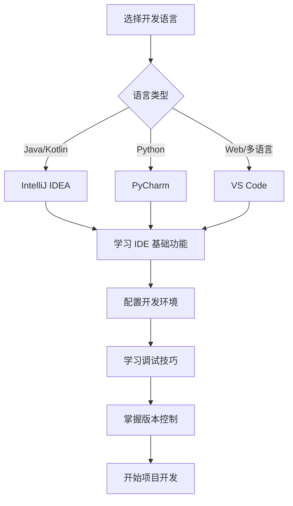

# 开发工具指南

欢迎来到开发工具指南！这里为你提供了各种主流开发工具的下载、安装和使用教程。

## 🛠️ 工具分类

### 集成开发环境 (IDE)

| 工具 | 适用语言 | 特点 | 推荐指数 |
|------|----------|------|----------|
| [IntelliJ IDEA](idea.md) | Java, Kotlin, Scala | 功能强大，智能提示优秀 | ⭐⭐⭐⭐⭐ |
| [PyCharm](pycharm.md) | Python | Python 开发首选 | ⭐⭐⭐⭐⭐ |
| [Visual Studio Code](vscode.md) | 多语言 | 轻量级，插件丰富 | ⭐⭐⭐⭐⭐ |

### 版本控制工具

| 工具 | 类型 | 特点 | 推荐指数 |
|------|------|------|----------|
| [Git](git.md) | 分布式版本控制 | 业界标准，功能强大 | ⭐⭐⭐⭐⭐ |

## 🚀 快速开始

1. **选择合适的工具**：根据你的开发语言和需求选择合适的 IDE
2. **下载安装**：按照教程下载并安装工具
3. **基础配置**：完成必要的初始配置
4. **开始开发**：创建你的第一个项目

## 💡 使用建议

- **新手推荐**：如果你是编程新手，建议从 Visual Studio Code 开始
- **Java 开发**：强烈推荐使用 IntelliJ IDEA
- **Python 开发**：PyCharm 是最佳选择
- **多语言开发**：Visual Studio Code 是不错的选择

## 📚 学习路径

## 🔗 相关资源

- [JetBrains 官方网站](https://www.jetbrains.com/)
- [Visual Studio Code 官方网站](https://code.visualstudio.com/)
- [Git 官方网站](https://git-scm.com/)

---

选择一个工具开始你的开发之旅吧！每个工具都有详细的安装和使用教程。