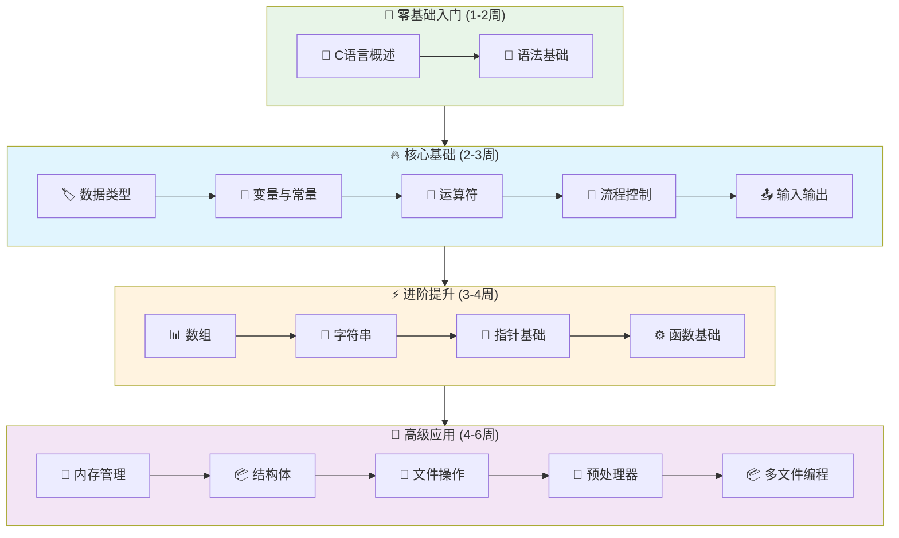

# C语言学习指南

## 📚 课程大纲

### 🚀 第一章：入门基础
- [📖 C语言概述](intro.md) - 历史、特点与应用领域
- [🔧 语法基础](syntax.md) - 基本语法规则与代码风格

### 📊 第二章：数据与变量
- [🏷️ 数据类型](types.md) - 基本数据类型详解
- [🔢 变量与常量](variable.md) - 变量定义、作用域与生命周期
- [🔧 类型说明符](specifier.md) - 存储类说明符详解
- [🏷️ 类型定义](typedef.md) - typedef 关键字使用

### ⚡ 第三章：运算与控制
- [🧮 运算符](operator.md) - 算术、关系、逻辑运算符
- [🎯 流程控制](flow-control.md) - 条件语句与循环结构
- [📤 输入输出](io.md) - 标准输入输出函数

### 📋 第四章：数组与字符串
- [📊 数组](array.md) - 一维、多维数组操作
- [📝 字符串](string.md) - 字符串处理与库函数
- [🌐 多字节字符](multibyte.md) - 国际化字符处理

### 🔗 第五章：指针与内存
- [🎯 指针基础](pointer.md) - 指针概念与基本操作
- [💾 内存管理](memory.md) - 动态内存分配与释放

### ⚙️ 第六章：函数编程
- [📋 函数基础](function.md) - 函数定义、调用与参数传递
- [💻 命令行参数](cli.md) - main函数参数处理

### 🏗️ 第七章：复合数据类型
- [📦 结构体](struct.md) - 结构体定义与使用
- [🔄 联合体](union.md) - 联合体概念与应用
- [📛 枚举](enum.md) - 枚举类型定义

### 📁 第八章：文件操作
- [📂 文件操作](file.md) - 文件读写与处理

### 🎯 第九章：高级主题
- [🔄 预处理器](preprocessor.md) - 宏定义与条件编译
- [📦 多文件编程](multifile.md) - 头文件与模块化编程

---

## 🎯 学习路径推荐

### 🌟 零基础入门 (1-2周)
```
📖 C语言概述 → 🔧 语法基础
```

### 🔥 核心基础 (2-3周)
```
🏷️ 数据类型 → 🔢 变量与常量 → 🧮 运算符 → 🎯 流程控制 → 📤 输入输出
```

### ⚡ 进阶提升 (3-4周)
```
📊 数组 → 📝 字符串 → 🎯 指针基础 → ⚙️ 函数基础
```

### 🚀 高级应用 (4-6周)
```
💾 内存管理 → 📦 结构体 → 📂 文件操作 → 🔄 预处理器 → 📦 多文件编程
```

---

## 📚 重点专题

### 🎯 核心难点
- [🎯 指针详解](pointer.md) - 指针概念与基本操作
- [💾 内存管理](memory.md) - 动态内存分配与释放
- [📂 文件操作](file.md) - 文件读写与处理
- [📦 结构体](struct.md) - 结构体定义与使用

### 🔧 高级特性
- [🔄 预处理器](preprocessor.md) - 宏定义与条件编译
- [📦 多文件编程](multifile.md) - 头文件与模块化编程
- [🌐 多字节字符](multibyte.md) - 国际化字符处理
- [💻 命令行参数](cli.md) - main函数参数处理

---

## 📈 学习进度图表



---

## 🎯 学习目标

### 🏆 掌握要点
- **语法基础** - 熟练使用C语言基本语法和数据类型
- **指针操作** - 深入理解指针概念，掌握内存管理
- **函数编程** - 能够设计和实现模块化程序
- **文件处理** - 掌握文件读写和数据持久化
- **结构体应用** - 理解复合数据类型的使用
- **预处理** - 掌握宏定义和条件编译

---

*📅 最后更新: 2025年10月18日*