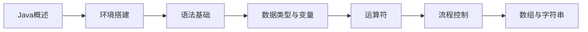
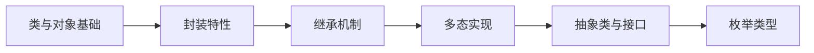
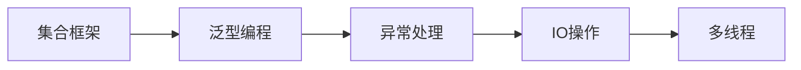
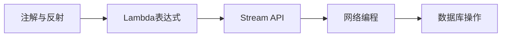
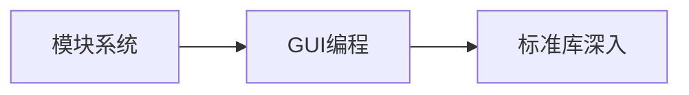

# 学习指南

## 📚 课程大纲

### 🚀 第一章：Java概述与环境搭建
- [📖 Java概述](intro.md) - 历史、特点与应用领域
- [⚙️ 开发环境](environment.md) - JDK安装与IDE配置

### 📝 第二章：基础语法与数据类型
- [🔧 语法基础](syntax.md) - 基本语法规则与代码风格
- [🏷️ 数据类型](types.md) - 基本数据类型与引用类型
- [🔢 变量与作用域](variable.md) - 变量定义、作用域与生命周期
- [🔒 常量与修饰符](constant.md) - final关键字与访问修饰符

### ⚡ 第三章：运算符与流程控制
- [🧮 运算符](operator.md) - 算术、关系、逻辑运算符
- [🎯 流程控制](flow-control.md) - 条件语句与循环结构

### 📊 第四章：数组与字符串
- [📊 数组](array.md) - 一维、多维数组操作
- [📝 字符串](string.md) - String类与字符串处理

### 🏗️ 第五章：面向对象基础
- [📦 类与对象](class.md) - 类的定义与对象的创建
- [🎯 对象操作](object.md) - 构造方法、方法重载与this关键字
- [🔐 封装](encapsulation.md) - 访问控制与getter/setter

### 🔥 第六章：面向对象高级特性
- [🔗 继承](inheritance.md) - 继承机制与super关键字
- [🎭 多态](polymorphism.md) - 方法重写与动态绑定
- [📜 抽象类](abstract-class.md) - 抽象类的定义与实现
- [📝 接口](interface.md) - 接口的定义与实现
- [🔢 枚举](enum.md) - 枚举的定义与使用

### 📚 第七章：集合框架
- [📚 集合框架](collection.md) - List、Set、Map等集合类

### 🔧 第八章：泛型编程
- [📋 泛型基础](generic.md) - 泛型类、方法与通配符

### ⚠️ 第九章：异常处理
- [🚨 异常机制](exception.md) - try-catch-finally与异常类型

### 📁 第十章：输入输出处理
- [📤 基础IO](io.md) - 标准输入输出与Scanner类
- [📂 文件操作](file.md) - 文件读写与NIO

### 🧵 第十一章：多线程编程
- [⚡ 线程基础](thread.md) - Thread类与Runnable接口

### 🏷️ 第十二章：注解与反射
- [📌 注解](annotation.md) - 内置注解与自定义注解
- [🔍 反射机制](reflection.md) - Class类与反射API

### 🚀 第十三章：Lambda与Stream
- [λ Lambda表达式](lambda.md) - 函数式编程基础
- [🌊 Stream API](stream.md) - 流式数据处理

### 🌐 第十四章：网络编程
- [🔗 网络通信](network.md) - Socket编程与HTTP客户端

### 🗄️ 第十五章：数据库编程
- [💾 JDBC](database.md) - 数据库连接与SQL操作

### 📦 第十六章：模块化系统
- [📦 模块系统](module.md) - Java 9模块化编程

### 🖥️ 第十七章：GUI编程
- [🎨 图形界面](gui.md) - Swing与JavaFX基础

### 📚 第十八章：标准库参考
- [🔧 常用类库](lib/index.md) - Java核心API参考

---

## 🎯 学习路径推荐

### 🌟 基础阶段 (2-3周)

### 🏗️ 面向对象阶段 (3-4周)

### 🚀 核心API阶段 (3-4周)

### 🔥 高级特性阶段 (3-4周)

### 🎯 扩展应用阶段 (2-3周)

---

## 📖 学习建议

### 💡 学习方法
1. **循序渐进** - 严格按照章节顺序学习，每个概念都要理解透彻
2. **代码实践** - 每个知识点都要动手编写代码验证
3. **项目驱动** - 学完每个阶段尝试做一个小项目巩固知识
4. **文档习惯** - 学会查阅Java官方API文档

### 🛠️ 开发环境
- **JDK版本**: Java 11 LTS 或 Java 17 LTS（推荐）
- **IDE**: IntelliJ IDEA（首选）、Eclipse、VS Code
- **构建工具**: Maven、Gradle
- **版本控制**: Git

### 📚 学习资源
- [Oracle官方Java文档](https://docs.oracle.com/javase/)
- [Java API规范](https://docs.oracle.com/javase/8/docs/api/)
- [OpenJDK项目](https://openjdk.java.net/)

---

## 🎓 学习目标

### ✅ 基础能力
- 熟练掌握Java核心语法和编程规范
- 理解面向对象编程思想和设计原则
- 掌握基本算法和数据结构应用

### ✅ 核心开发能力
- 熟练使用Java集合框架和泛型
- 掌握异常处理机制和调试技巧
- 具备文件操作和IO编程能力
- 理解多线程编程和并发基础

### ✅ 高级特性
- 掌握函数式编程和Stream API
- 理解反射机制和注解应用
- 具备网络编程和数据库操作能力

### ✅ 工程实践能力
- 能够设计中等规模Java应用程序
- 掌握模块化开发和代码组织
- 具备GUI应用开发基础能力
- 理解软件设计模式和重构技巧

---

*开始你的Java编程之旅！记住：编程能力的提升源于持续的实践和思考！* 🚀