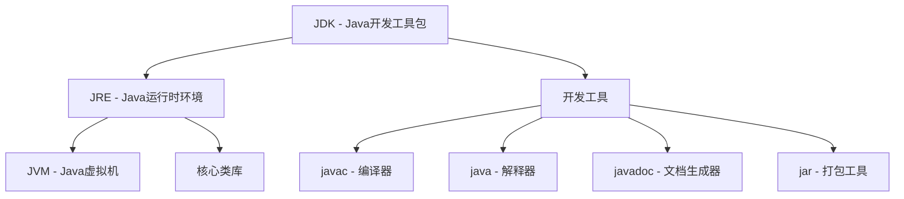

# 语言简介

## 历史

Java 语言是由 Sun Microsystems 公司（现已被 Oracle 收购）开发的一种面向对象的编程语言。

1991年，Sun公司的詹姆斯·高斯林（James Gosling）领导的团队开始开发一种名为"Oak"的编程语言，最初是为了开发消费电子产品。由于商标问题，1995年正式发布时改名为"Java"。

Java的发展历程：

- **1995年** - Java 1.0 发布，提出"一次编写，到处运行"的理念
- **1997年** - Java 1.1 发布，引入内部类、JavaBeans等特性
- **1998年** - Java 1.2 发布，引入集合框架，分为J2SE、J2EE、J2ME三个版本
- **2000年** - Java 1.3 发布，改进性能和稳定性
- **2002年** - Java 1.4 发布，引入断言、正则表达式、NIO等
- **2004年** - Java 5.0 发布，引入泛型、枚举、注解、自动装箱等重要特性
- **2006年** - Java 6 发布，性能优化和API增强
- **2011年** - Java 7 发布，引入try-with-resources、钻石操作符等
- **2014年** - Java 8 发布，引入Lambda表达式、Stream API等函数式编程特性
- **2017年** - Java 9 发布，引入模块系统
- **2018年** - Java 10 发布，引入局部变量类型推断
- **2018年** - Java 11 发布（LTS长期支持版本）
- **2021年** - Java 17 发布（LTS长期支持版本）
- **2023年** - Java 21 发布（LTS长期支持版本）

## Java 语言的特点

Java 语言之所以能够成为世界上最流行的编程语言之一，主要得益于以下特点：

### （1）面向对象

Java 是一种纯面向对象的编程语言，支持封装、继承、多态等面向对象的核心特性。在Java中，除了基本数据类型外，一切都是对象。

### （2）平台无关性

Java 程序编译后生成字节码（bytecode），运行在Java虚拟机（JVM）上。只要安装了JVM，Java程序就可以在任何操作系统上运行，真正实现了"一次编写，到处运行"（Write Once, Run Anywhere）。

### （3）安全性

Java 提供了多层次的安全机制：
- 字节码验证器确保代码的安全性
- 安全管理器控制程序的访问权限
- 自动内存管理避免了指针操作的安全隐患

### （4）健壮性

Java 具有强类型检查机制，在编译时和运行时都会进行严格的类型检查。同时，Java的异常处理机制和自动垃圾回收机制大大提高了程序的健壮性。

### （5）多线程支持

Java 内置了多线程支持，提供了Thread类和Runnable接口，以及synchronized关键字等同步机制，使得开发并发程序变得相对简单。

### （6）高性能

虽然Java是解释执行的，但JVM采用了即时编译（JIT）技术，将热点代码编译成本地机器码，大大提高了执行效率。

### （7）分布式

Java 提供了丰富的网络编程API，支持TCP/IP协议，可以轻松开发分布式应用程序。

### （8）动态性

Java 支持动态加载类，可以在运行时加载、链接和使用类，这为开发灵活的应用程序提供了基础。

## Java 平台架构

Java 平台主要由以下几个部分组成：

### Java 虚拟机（JVM）
JVM 是Java程序的运行环境，负责执行Java字节码。不同的操作系统有不同的JVM实现，但都遵循相同的JVM规范。

### Java 运行时环境（JRE）
JRE 包含了运行Java程序所需的JVM和核心类库，是Java程序的运行环境。

### Java 开发工具包（JDK）
JDK 包含了JRE以及开发Java程序所需的工具，如编译器（javac）、调试器（jdb）等。



## Java 的应用领域

Java 语言应用广泛，主要包括以下领域：

### （1）企业级应用开发
Java EE（现在称为Jakarta EE）提供了完整的企业级应用开发框架，广泛用于大型企业系统开发。

### （2）Web 开发
Spring、Spring Boot、Struts等框架使Java成为Web开发的主流选择之一。

### （3）Android 应用开发
Android 系统的应用程序主要使用Java语言开发（现在也支持Kotlin）。

### （4）大数据处理
Hadoop、Spark、Kafka等大数据处理框架都是用Java开发的。

### （5）科学计算
Java 在科学计算领域也有广泛应用，如生物信息学、金融建模等。

### （6）桌面应用开发
虽然不如Web应用流行，但Java仍然可以用于开发跨平台的桌面应用程序。

## Java 版本选择

目前Java有多个版本在使用，主要包括：

### LTS（长期支持）版本
- **Java 8** - 仍然广泛使用，但已经比较老旧
- **Java 11** - 目前企业级应用的主流选择
- **Java 17** - 新项目的推荐选择
- **Java 21** - 最新的LTS版本

### 版本选择建议
- **新项目**：推荐使用Java 17或Java 21 
- **企业项目**：Java 11是稳妥的选择
- **学习目的**：建议使用Java 17或更新版本

## Hello World 示例

让我们从一个简单的"Hello World"程序开始Java之旅：

```java
public class HelloWorld {
    public static void main(String[] args) {
        System.out.println("Hello, World!");
    }
}
```

这个程序的组成部分：

1. **类声明**：`public class HelloWorld` 声明了一个名为HelloWorld的公共类
2. **主方法**：`public static void main(String[] args)` 是程序的入口点
3. **输出语句**：`System.out.println()` 用于输出文本到控制台

### 编译和运行

1. 将代码保存为 `HelloWorld.java` 文件
2. 使用 `javac HelloWorld.java` 编译程序
3. 使用 `java HelloWorld` 运行程序

```bash
# 编译
javac HelloWorld.java

# 运行
java HelloWorld
```

输出结果：
```
Hello, World!
```

## Java 开发环境

要开始Java开发，你需要：

### 必需工具
1. **JDK** - Java开发工具包
2. **文本编辑器或IDE** - 用于编写代码

### 推荐IDE
- **IntelliJ IDEA** - 功能强大，社区版免费
- **Eclipse** - 开源免费，插件丰富
- **VS Code** - 轻量级，支持Java扩展
- **NetBeans** - Oracle官方IDE

### 在线开发环境
如果暂时不想安装本地环境，可以使用在线IDE：
- [Replit](https://replit.com/)
- [CodePen](https://codepen.io/)
- [OnlineGDB](https://onlinegdb.com/)

---

Java是一门功能强大、应用广泛的编程语言。掌握Java不仅能让你开发各种类型的应用程序，还能为学习其他编程语言打下坚实的基础。让我们开始这段精彩的Java学习之旅吧！