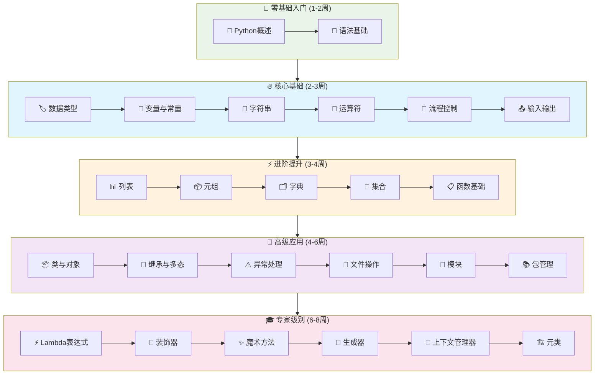

# Python学习指南

## 📚 课程大纲

### 🚀 第一章：入门基础
- [📖 Python概述](intro.md) - 历史、特点与应用领域
- [🔧 语法基础](syntax.md) - 基本语法规则与代码风格

### 📊 第二章：数据与变量
- [🏷️ 数据类型](types.md) - 基本数据类型详解
- [🔢 变量与常量](variable.md) - 变量定义、作用域与生命周期
- [📝 字符串](string.md) - 字符串处理与方法

### ⚡ 第三章：运算与控制
- [🧮 运算符](operator.md) - 算术、关系、逻辑运算符
- [🎯 流程控制](flow-control.md) - 条件语句与循环结构
- [📤 输入输出](io.md) - 标准输入输出函数

### 📋 第四章：数据结构
- [📊 列表](list.md) - 列表操作与方法
- [📦 元组](tuple.md) - 元组的使用与特性
- [🗂️ 字典](dict.md) - 字典操作与应用
- [🔗 集合](set.md) - 集合运算与方法

### ⚙️ 第五章：函数编程
- [📋 函数基础](function.md) - 函数定义、调用与参数传递
- [⚡ Lambda表达式](lambda.md) - 匿名函数与高阶函数
- [🎨 装饰器](decorator.md) - 装饰器模式与应用

### 🏗️ 第六章：面向对象
- [📦 类与对象](class.md) - 类定义与实例化
- [🔄 继承与多态](inheritance.md) - 继承机制与多态性
- [✨ 魔术方法](magic-methods.md) - 特殊方法与运算符重载

### 🛡️ 第七章：异常处理
- [⚠️ 异常处理](exception.md) - 异常捕获与处理机制

### 📁 第八章：文件操作
- [📂 文件操作](file.md) - 文件读写与处理

### 📦 第九章：模块与包
- [🧩 模块](module.md) - 模块导入与使用
- [📚 包管理](package.md) - 包的创建与管理

### 🔧 第十章：标准库
- [📖 标准库](stdlib.md) - 常用标准库介绍

### 🎯 第十一章：高级特性
- [🔄 生成器](generator.md) - 生成器与迭代器
- [🎯 上下文管理器](context-manager.md) - with语句与资源管理
- [🏗️ 元类](metaclass.md) - 元类概念与应用

---

## 🎯 学习路径推荐

### 🌟 零基础入门 (1-2周)
```
📖 Python概述 → 🔧 语法基础
```

### 🔥 核心基础 (2-3周)
```
🏷️ 数据类型 → 🔢 变量与常量 → 📝 字符串 → 🧮 运算符 → 🎯 流程控制 → 📤 输入输出
```

### ⚡ 进阶提升 (3-4周)
```
📊 列表 → 📦 元组 → 🗂️ 字典 → 🔗 集合 → 📋 函数基础
```

### 🚀 高级应用 (4-6周)
```
📦 类与对象 → 🔄 继承与多态 → ⚠️ 异常处理 → 📂 文件操作 → 🧩 模块 → 📚 包管理
```

### 🎓 专家级别 (6-8周)
```
⚡ Lambda表达式 → 🎨 装饰器 → ✨ 魔术方法 → 🔄 生成器 → 🎯 上下文管理器 → 🏗️ 元类
```

---

## 📚 重点专题

### 🎯 核心难点
- [📦 类与对象](class.md) - 面向对象编程基础
- [🔄 继承与多态](inheritance.md) - 继承机制与多态性
- [🎨 装饰器](decorator.md) - 装饰器模式与应用
- [⚠️ 异常处理](exception.md) - 异常捕获与处理机制

### 🔧 高级特性
- [⚡ Lambda表达式](lambda.md) - 匿名函数与高阶函数
- [✨ 魔术方法](magic-methods.md) - 特殊方法与运算符重载
- [🔄 生成器](generator.md) - 生成器与迭代器
- [🎯 上下文管理器](context-manager.md) - with语句与资源管理
- [🏗️ 元类](metaclass.md) - 元类概念与应用

---

## 📈 学习进度图表



---

## 🎯 学习目标

### 🏆 掌握要点
- **语法基础** - 熟练使用Python基本语法和数据类型
- **数据结构** - 掌握列表、字典、集合等数据结构的使用
- **函数编程** - 能够设计和实现模块化程序
- **面向对象** - 理解类、继承、多态等面向对象概念
- **异常处理** - 掌握异常捕获和处理机制
- **文件处理** - 掌握文件读写和数据持久化
- **模块系统** - 理解模块导入和包管理
- **高级特性** - 掌握装饰器、生成器等高级特性

---

*📅 最后更新: 2025年10月18日*